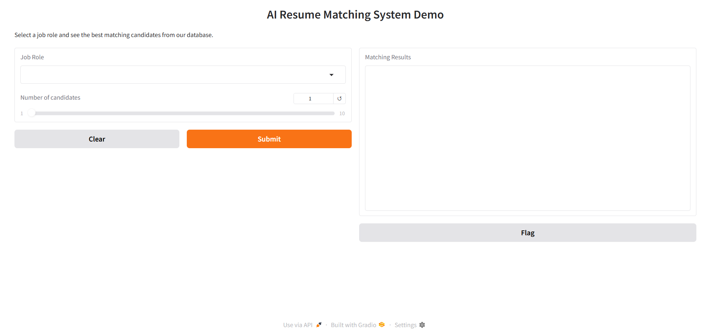

# SmartHire - AI-Powered Resume & Job Match System
Smart recruitment system using NLP and ML to match candidates with job roles. Built with SentenceTransformers, scikit-learn, and Gradio for interactive demos.

    

# 🚀 What This Does
- **Problem:**
   Recruiters spend hours manually screening resumes and matching candidates to job postings.

- **Solution:** This system automatically
  - Screens resumes with 85%+ accuracy using ML models
  - Matches candidates to jobs using semantic similarity
  - Explains WHY a candidate is a good fit (explainable AI)
  - Provides salary predictions and hiring probability scores
 
Built from a real dataset of 1,000+ resumes with actual hiring decisions.

# ⚡ Quick Demo

- **Run in Google Colab (recommended):**
  - Upload main.ipynb to Google Colab
  - Upload your AI_Resume_Screening.csv dataset
  - Run all cells - everything installs automatically
  - Get instant results with the interactive Gradio demo
  
Test with your own data: Just replace the CSV file with your resume dataset.
